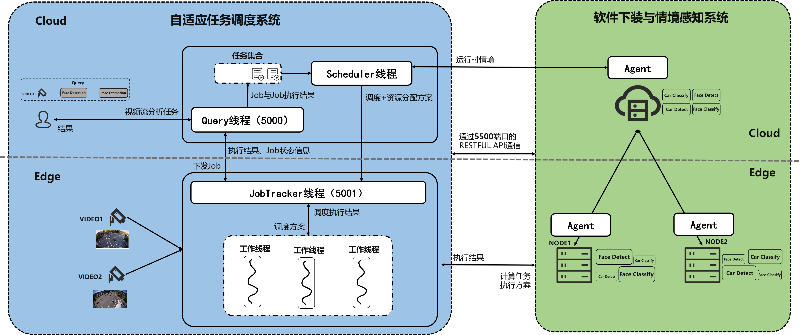

# SchedulingSystem
以下为main-demo分支的新增说明。

本工程为mian-demo分支下的代码，相比最初的mian-render版本，进行了如下改动：

（1）修改了`app_server.py`和`app_client.py`中ServerManager和ClientManager的__init__方法中对server_port和edge_port端口的初始化为6500，目的是和no-render-demo分支下的新端口进行匹配。

（2）新建了`app_server_test.py`和`app_client_test.py`，二者相比原来的`app_server.py`和`app_client.py`，区别在于不需要进行软件下装，直接运行就可以根据写好的配置启动服务。仅用于测试，不用于实际。当前client和server目录下有car_detection等目录，就是为了给`app_server_test.py`和`app_client_test.py`提供无需下装的服务，请勿删除，

（3）新增了“下装代码-新版”目录，内含下装时需要的zip压缩包和配置文件。注意，为加快运行速度，建议使用face_pose_estimation_new_cuda.json和car_detection_new_cuda.json


本工程最好结合video-dag-manager下no-render-demo的query_manager_v2.py和job_manager_v2.py使用。如果不愿意使用6500作为端口，使用本工程代码时需要修改`app_server.py`和`app_client.py`中ServerManager和ClientManager的__init__方法中对server_port和edge_port端口的初始化。本人并不建议进行这样的修改。

建议启动方法（不修改上文所说的这些初始化端口的前提下）：

首先执行sudo systemctl restart jtop.service，防止执行过程中服务未响应。

如果是在云端，运行python3.8 SchedulingSystem-main-demo/SchedulingSystem/server/app_server.py --server_ip=114.212.81.11 --server_port=6500 --edge_port=6500

如果是在边缘端，运行python3 SchedulingSystem-main-demo/SchedulingSystem/client/app_client.py --server_ip=114.212.81.11 --server_port=6500 --edge_ip=0.0.0.0 --edge_port=6500

以下为main版本的原始readme内容。
### 1 大致结构


云端运行`app_server.py`，在5500端口提供服务；

边端运行`app_client.py`，在5500端口提供服务；

系统整体结构如下图所示。本仓库为下图中的`软件下装与情境感知系统`，此外情境感知在`video-dag-manager`仓库中也有部分实现。



### 2 代码结构说明：
```
SchedulingSystem
|--README.md
|--InterfaceSpecification.md  // 接口说明文档（运行时情境、软件下装、计算服务调用）
|--RelatedLearning.md  // 项目相关的学习参考链接
|--test.py  // 辅助测试系统功能
|
|--server
|--|--app_server.py  // 云端入口文件
|--|--field_codec_utils.py  // 图像编解码工具文件
|--|--dist  // 旧版前端页面，用于测试软件下装功能，后续可弃用
|--|--templates  // 旧版前端页面，用于测试软件下装功能，后续可弃用
|
|--client
|--|--app_client.py  // 边端入口文件
|--|--field_codec_utils.py  // 图像编解码工具文件
```
### 3 系统启动方式：
* 启动云端，执行命令如下：
```shell
# --server_ip指定云端提供服务的ip，设置为服务器的公网ip
# 注意，在ServerManager的构造函数中self.server_ip初始设置需要与服务器ip保持一致，供定时事件使用
# --server_port指定云端提供服务的port
# --edge_port指定边端提供服务的port，所有边端保持一致
python3 app_server.py --server_ip=114.212.81.11 --server_port=5500 --edge_port=5500
```
* 启动边缘端，执行命令如下：
```shell
# --server_ip指定云端提供服务的ip, --server_port指定云端提供服务的port
# --edge_ip指定边端提供服务的ip,设置为0.0.0.0以便同时提供定时事件和计算服务
# --edge_port指定边端提供服务的port
python3 app_client.py --server_ip=114.212.81.11 --server_port=5500 --edge_ip=0.0.0.0 --edge_port=5500
```

### 4 补充说明：
在`video-dag-manager`仓库中的`service_demo.py`其实充当了本仓库的作用，是为了方便调度器调试代码pqh自己写的，所以调调度算法的时候可以先不跑本仓库的代码。
但最终要实现两部分代码合并运行。


